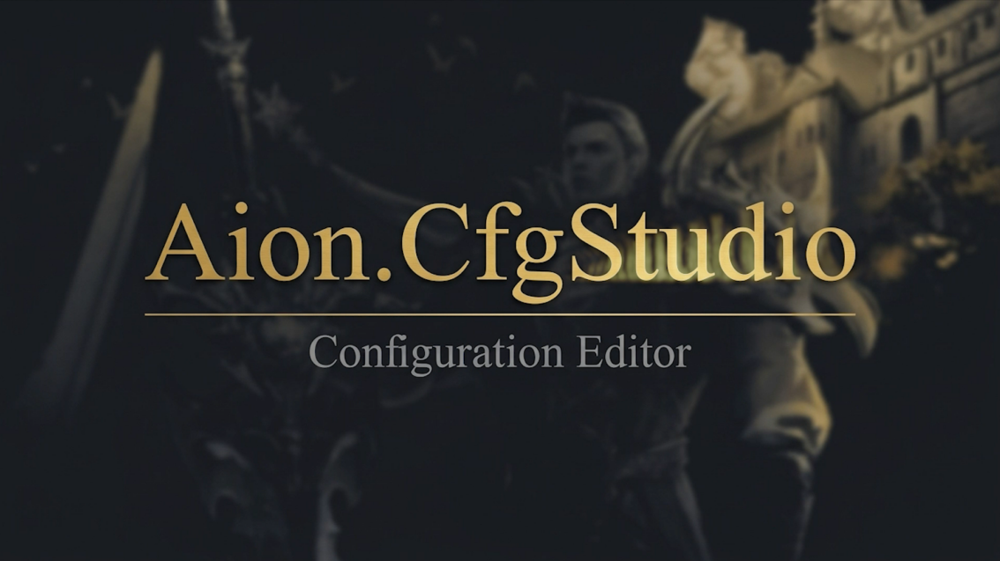
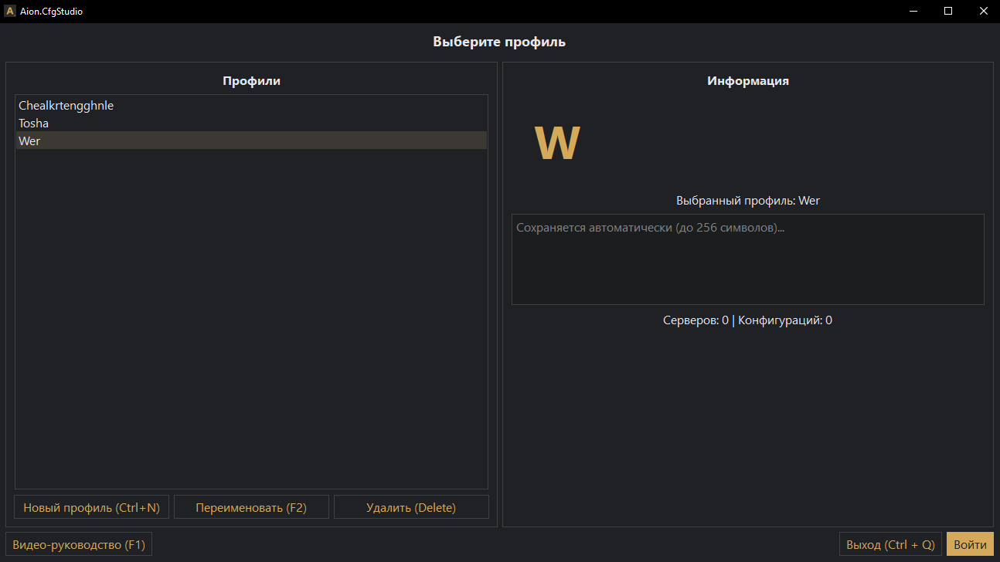
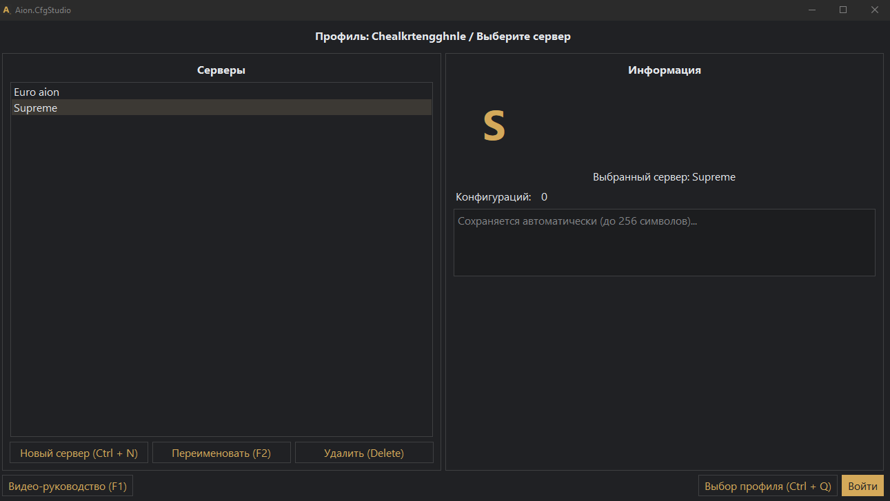
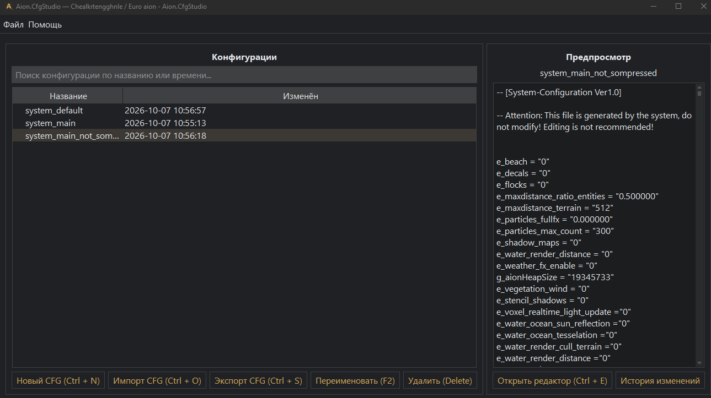
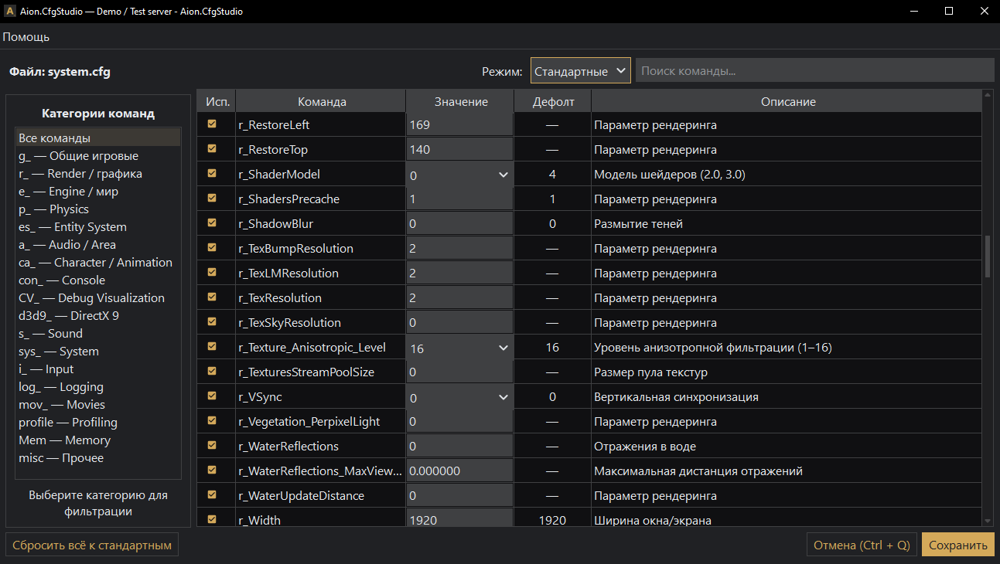
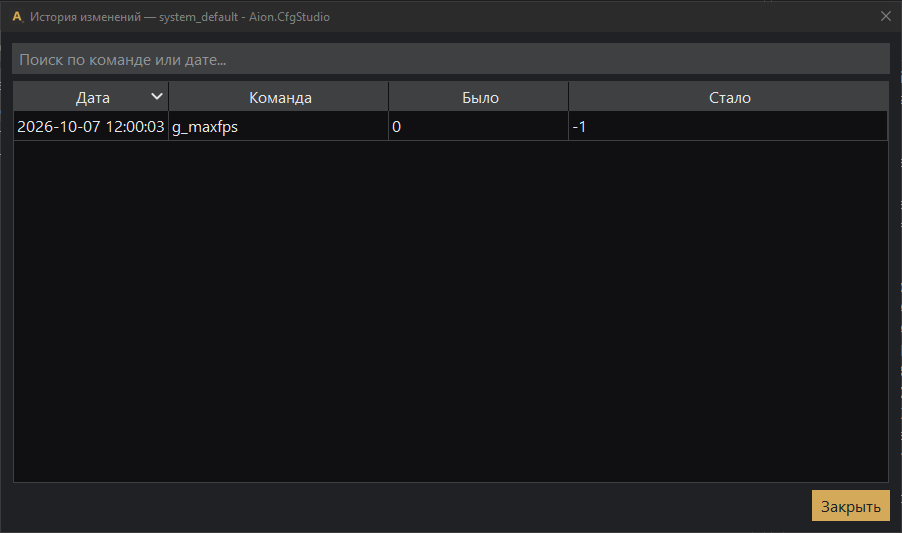
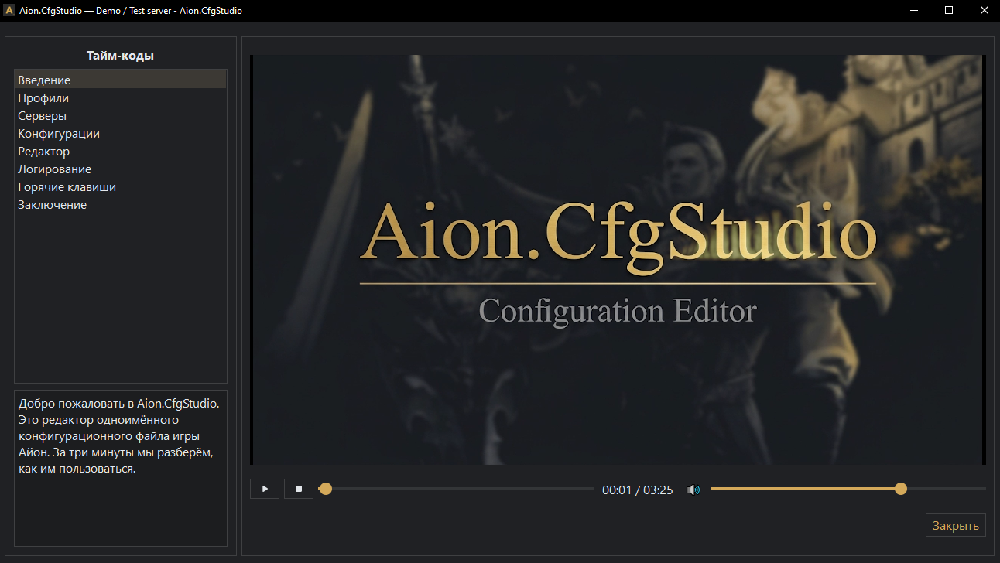

# Aion.CfgStudio

Десктопное приложение для редактирования конфигурационных файлов клиента игры Aion. Написано на Python + PyQt6, использует SQLite, собирается в standalone `.exe`.



## Возможности

- Профили и серверы: несколько наборов конфигураций с описаниями и заметками.
- Импорт / экспорт `system.cfg` - с XOR-деобфускацией и обфускацией.
- Редактор 1100+ команд: фильтры по категории, режиму и поиску; удаление дубликатов в импортированных конфигах (в качестве финального знания берётся значение последнего вхождения соответствующей команды).
- История изменений: фиксируются только реально изменившиеся значения.
- Видео-руководство: F1 открывает видео на GitHub (плеер скрыт, код сохранён).
## Скриншоты

### Профили



### Серверы



### Дерево конфигураций



### Редактор команд



### История изменений



### Видео-плеер



## Архитектура

Проект построен по паттерну **MVP (Model-View-Presenter)**:
```
View -> Presenter → Service -> Repository -> DBManager
```

| Слой | Ответственность | Знает о |
|---|---|---|
| **View** (`page_*.py`) | Только UI. Виджеты, отрисовка, диалоги. | Presenter |
| **Presenter** (`logic/presenters/`) | Логика UI: связка View и сервисов, навигация, обработка ошибок. | View, Service |
| **Service** (`logic/services/`) | Бизнес-правила: валидация, уникальность, шифрование. Не знает о Qt. | Repository |
| **Repository** (`logic/repositories/`) | Доступ к данным через единый интерфейс. Тонкая обёртка над `DBManager`. | DBManager |
| **DBManager** (`database/`) | Низкий уровень: SQL, соединение, схема. | SQLite |

**Плюсы:**
- **Тестируемость**: сервисы чистые, тестируются без GUI.
- **Заменяемость**: можно поменять UI без правок в сервисах.
- **Читаемость**: каждая ответственность на своём месте.

**Пример** (создание профиля):
1. Пользователь жмёт «Новый профиль».
2. `View` -> `presenter.create()`.
3. `Presenter` спрашивает имя через `view.ask_name_hint(...)`.
4. `Presenter` -> `service.create(name)`.
5. `Service` валидирует имя, проверяет уникальность.
6. `Service` -> `repo.create(name)`.
7. `Repository` -> `db.create_profile(name)`.
8. `DBManager` выполняет `INSERT`.

## Производительность

### Редактор команд

Таблица из **1105 команд** построена через **`QStyledItemDelegate`**. Вместо виджетов в ячейках используются **данные** (`QTableWidgetItem`), а редакторы (`QComboBox`, `QSpinBox`, `QLineEdit`) создаются **только в момент клика**.

**Результат:**
- Построение таблицы: **~0.2 сек** (было ~2 сек с виджетами).
- Память: **в 10–20 раз меньше**.
- Скролл: **плавный**.

### Ленивая загрузка

Строки строятся **только для видимых команд** (под текущий фильтр). При смене режима / префикса / поиска таблица **перестраивается мгновенно**.

Состояние **всех** команд хранится в `EditorPresenter._state`. Это позволяет **сохранять и логировать** изменения даже тех команд, которые **скрыты фильтром**.

## Технологии

| **_Компонент_** | **_Технология_** |
|---|---|
| Язык | Python 3.12+ |
| GUI | PyQt6 |
| БД | SQLite |
| Сборка | PyInstaller (`--onedir`) |
| Установщик | Inno Setup 6 |
| Тема | qdarktheme |

## Установка

### Вариант 1 - готовая сборка

1. Скачай `AionCfgStudio_Setup_v1.1.exe` из [Releases](https://github.com/chlkrtg/Aion.CfgStudio/releases).
2. Запусти установщик.
3. Ярлык появится в меню "Пуск".

Требования: Windows 10/11.

### Вариант 2 - из исходников

```
git clone https://github.com/chlkrtg/Aion.CfgStudio.git
cd Aion.CfgStudio
git checkout mvp-refactoring
python -m venv .venv
.venv\Scripts\activate
pip install -r requirements.txt
python main.py
```
## Для разработчиков

### Установка окружения

```bash
git clone https://github.com/chlkrtg/Aion.CfgStudio.git
cd Aion.CfgStudio
git checkout mvp-refactoring
python -m venv .venv
.venv\Scripts\activate
pip install -r requirements-dev.txt
python main.py
```

### Видео-руководство

В данной реализации программы плеер скрыт, а соответствующая его открытию горячая клавиша ведёт на [YouTube](https://youtu.be/TK2jVAArRhM).

**Если вы собираете из исходников с возвращением страницы плеера** - положите `tutorial.mp4`из раздела [Releases](https://github.com/chlkrtg/Aion.CfgStudio/releases) в папку `media/`. Без него приложение работает, но кнопка **F1** покажет "видео не найдено".

### Генерация озвучки

Скрипт `generate_voice.py` создаёт озвучку для видео-руководства через **Silero TTS v5_ru**.

**Требования:**
- Установленный `torch`, `soundfile`, `numpy` (входят в `requirements-dev.txt`).
- Файл модели `v5_ru.pt` в корне проекта.

**Скачать модель:**

```
https://models.silero.ai/models/tts/ru/v5_ru.pt
```

Положите `v5_ru.pt` рядом с `generate_voice.py`.

**Запуск:**

```bash
# все блоки, голос по умолчанию (aidar)
python generate_voice.py

# конкретный голос
python generate_voice.py --speaker xenia

# только один блок (для теста)
python generate_voice.py --only 01_title --speaker xenia

# список доступных голосов
python generate_voice.py --list
```

**Доступные голоса:** `aidar`, `baya`, `kseniya`, `xenia`, `eugene`.

**Результат:** файлы `voice/01_title.wav` … `voice/08_final.wav`.

**Дальше:**
1. Запишите экран (OBS, ShadowPlay).
2. Смонтируйте видео в Premiere Pro / DaVinci / CapCut.
3. Наложите `voice/*.wav` на видео.
4. Экспортируйте как `media/tutorial.mp4` (H.264, AAC, 1920×1080, 30 fps).
5. Обновите тайм-коды глав в `database/schema.sql` (таблица `VideoChapters`).

### Сборка `.exe`

```bash
pyinstaller AionCfgStudio.spec --clean --noconfirm
```

Результат - папка `dist/AionCfgStudio/` с `.exe` и `_internal/`.

**Почему `--onedir`, а не `--onefile`:**
Встроенный плеер использует `QMediaPlayer` и `QVideoWidget`, которым нужны плагины QtMultimedia. В режиме `--onefile` они распаковываются в `%TEMP%` и не всегда находятся вовремя. `--onedir` размещает плагины рядом с `.exe` - они находятся корректно.

**Проверка:** запустите `.exe` на чистой машине без Python.

### Установщик

```bash
ISCC.exe installer\AionCfgStudio.iss
```

Готовый установщик - `installer/Output/AionCfgStudio_Setup_v1.1.exe`.

## Структура проекта

```
Aion.CfgEditor/
├── main.py # точка входа
├── requirements.txt # зависимости для запуска
├── requirements-dev.txt # зависимости для разработки
├── AionCfgStudio.spec # конфиг PyInstaller
├── README.md
├── LICENSE
├── .gitignore
│
├── logic/ # логика приложения
│ ├── app_window.py # главное окно + QStackedWidget
│ ├── base_page.py # общий предок страниц
│ ├── constants.py # ограничения длины, версия
│ ├── logs_dialog.py # таблица с логами
│ ├── shortcuts.py # хелперы для QShortcut
│ ├── context_menu.py # построение контекстных меню
│ ├── value_delegate.py # делегат для колонки значений
│ │
│ ├── repositories/ # доступ к БД (тонкая обёртка)
│ │ ├── __init__.py
│ │ ├── profile_repository.py
│ │ ├── server_repository.py
│ │ ├── config_repository.py
│ │ └── command_repository.py
│ │
│ ├── services/ # бизнес-логика (без Qt)
│ │ ├── __init__.py
│ │ ├── profile_service.py
│ │ ├── server_service.py
│ │ ├── config_service.py
│ │ ├── editor_service.py
│ │ └── reference_service.py
│ │
│ ├── presenters/ # логика UI (связка View и Service)
│ │ ├── __init__.py
│ │ ├── base_presenter.py
│ │ ├── profile_presenter.py
│ │ ├── server_presenter.py
│ │ ├── main_presenter.py
│ │ ├── editor_presenter.py
│ │ └── video_presenter.py
│ │
│ ├── page_profile.py # страница профилей (только UI)
│ ├── page_server.py # страница серверов (только UI)
│ ├── page_main.py # дерево cfg-файлов (только UI)
│ ├── page_editor.py # редактор команд (только UI)
│ └── page_video.py # видео-руководство (скрыто)
│
├── ui/ # формы Qt Designer
│ ├── command_editor.py/.ui
│ ├── main_window.py/.ui
│ ├── profile_select.py/.ui
│ ├── server_select.py/.ui
│ └── video_help.py/.ui
│
├── database/ # работа с БД
│ ├── db_manager.py # DBManager
│ ├── schema.sql # схема
│ ├── seed_commands.sql
│ ├── seed_updates.sql
│ ├── seed_modes.sql
│ └── generate_seed.py # скрипт генерации seed-файлов
│
├── parsers/ # парсеры
│ └── cfg_crypto.py # XOR-обработка
│
├── resources/ # ресурсы
│ └── icons/
│ ├── aion.cfgstudio.ico
│ └── aion.cfgstudio_ico.png
│
├── media/ # видео-руководство
│ └── tutorial.mp4 # не в Git — в Release
│
├── docs/ # документация
│ └── screenshots/
│ ├── editor.png
│ ├── main.png
│ └── player.png
│
├── installer/ # установщик
│ └── AionCfgStudio.iss # Inno Setup
│
└── generate_voice.py # генерация озвучки (dev)
```

## Горячие клавиши

| **_Клавиша_** | **_Действие_**                     |
|---|------------------------------------|
| F1 | Видео-руководство                  |
| F2 | Переименовать                      |
| Delete | Удалить                            |
| Ctrl+N | Создать                            |
| Ctrl+O | Импорт cfg                         |
| Ctrl+S | Экспорт cfg / сохранить в редакторе |
| Ctrl+E | Открыть редактор                   |
| Ctrl+Q | Назад / выход                      |
| Space | Пауза (в плеере)                   |
| ← / → | Перемотка 5 сек (в плеере)         |
| ↑ / ↓ | Громкость (в плеере)               |
| 0–9 | Переход к % видео (в плеере)       |
| Esc | Назад                              |

## Лицензия [](https://opensource.org/licenses/MIT)

MIT - см. [LICENSE](LICENSE).

## История версий

### v1.1
- Переход на **MVP-архитектуру**: repositories -> services -> presenters -> view.
- **Делегаты** в редакторе команд: ускорение в ~10 раз.
- **Ленивая загрузка** строк редактора.
- **Логирование** при автосохранении.
- **`ReferenceService`**: устранены пробои через слои.
- **`closeEvent`**: автосохранение при закрытии.

### v1.0
- Изначальная версия (см. [основную ветку](https://github.com/chlkrtg/Aion.CfgStudio/tree/main)).

## Благодарности

- [xan105/Aion-open-system-cfg-editor](https://github.com/xan105/Aion-open-system-cfg-editor) - алгоритм XOR-деобфускации.
- [Silero TTS](https://github.com/snakers4/silero-models) - озвучка видео-руководства.
- [qdarktheme](https://github.com/5yutan5/PyQtDarkTheme) - тёмная тема.

## Дисклеймер

Учебный проект. Не связан с NCSoft. Работает с локальными файлами конфигурации. Используется в образовательных целях.
